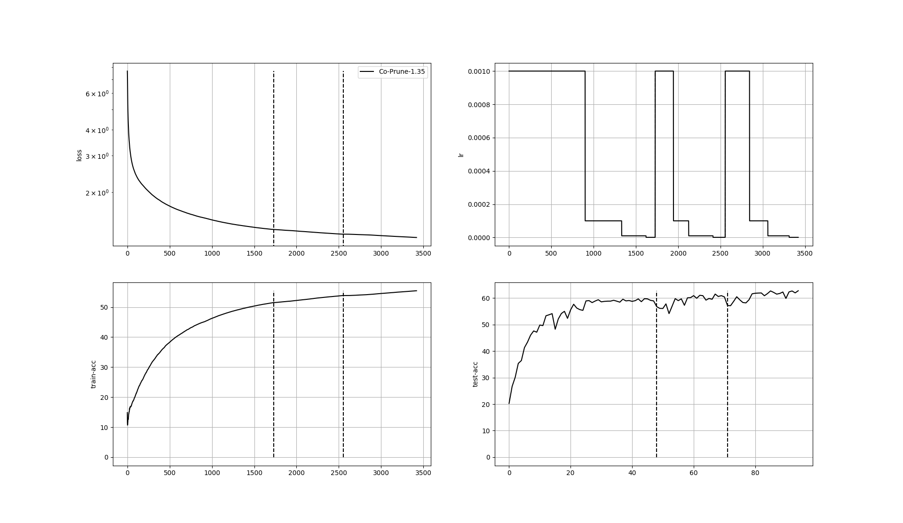

# Co-Prune
Codes for accepted paper "Cooperative Pruning in Cross-Domain Deep Neural Network Compression" in IJCAI 2019.

## How to use it

### Prepare dataset

#### CIFAR9-STL9

- Step 1: Please refer to [here](https://github.com/csyhhu/Awesome-Deep-Neural-Network-Compression/blob/master/Codes/README.md#specify-your-dataset-root)
for setting up your dataset root.
- Step 2: Set up your `CIFAR10` dataset path in `CIFAR10-CIFAR9.py`, then 
    
    ```python CIFAR10-CIFAR9``` 
    
    to generate `CIFAR9`.
- Step 3: Set up your `STL10` dataset path in `STL10-STL9.py`, then 
    
    ```python STL10-STL9``` 
    
    to generate `STL9`.

#### ImageCLEF

Under construction

### Prepare Pre-trained Model

User can skip this section if the uploaded pre-trained is used.
#### CIFARNet-CIFAR9

```
python train_base_model.py -m CIFARNet -d CIFAR9
```

#### CIFARNet-STL9

CIFARNet-STL9 is retrained using STL9 based on a pre-trained model from CIFAR9.

```
python train_base_model.py -m CIFARNet -d STL9 -r CIFARNet-CIFAR9/CIFARNet-CIFAR9-pretrain.pth -lr 1e-3
```

### Run the code
The workspace of Co-Prune is in `CIFARNet-CIFAR9-STL9`, which is made by user. 

Then a soft link is 
used to put pre-trained model from `CIFARNet-CIFAR9` and `CIFARNet-STL9` to this workspace.

Finally run the code.

```
mkdir ./Results/CIFARNet-CIFAR9-STL9
ln -s ./Results/CIFARNet-CIFAR9/CIFARNet-CIFAR9-pretrain.pth ./Results/CIFARNet-CIFAR9-STL9/CIFARNet-CIFAR9-pretrain.pth
ln -s ./Results/CIFARNet-STL9/CIFARNet-STL9-pretrain.pth ./Results/CIFARNet-CIFAR9-STL9/CIFARNet-STL9-pretrain.pth
python Co-Prune.py -a 0.7 0.5 0.3
```

Numbers appended by `-a` represents transfer factor \alpha changes during Co-Prune. 

### Visualize training log
Set the path and name for your desired visualization training log in `visualize_training_logtxt.py`.

```
python visualize_training_logtxt.py
```
## Experiments

| Method | Model | Domain | CR (%) | Target Pruned Acc | FP Acc |
| :-------:|:---:|:---:|:---:|:-------------:|:--------:|
| Co-Prune |CIFARNet|CIFAR9->STL9|1.35 | 62.79 | 68.03 |

### Training Log Visualization



## Customization

### Change Network Architecture
Please refer to `models.CIFARNet` to build your own model, remember to replace `nn.Conv2d` to `sparse_CNN` 
and `nn.Linear` to `sparse_Linear`.

In `forward` function, pay attention that I used `mask_dict` with self-specified layer name to index mask.

### Change Compression Rate (CR)
Change it in `CR_setting.py`.

## Acknowledgement
Some of my utils code is copied and modified from:
- [PyTorch with CIFAR10](https://github.com/kuangliu/pytorch-cifar): But its architecture is not quite situable for CIFAR10.

## Support
Leave an issue if there is any bug and email me if any concerns about paper.


## Citation
Cite the paper if anything helps you:
```
@article{chen2019cooperative,
  title={Cooperative Pruning in Cross-Domain Deep Neural Network Compression},
  author={Chen, Shangyu and Wang, Wenya and Pan, Sinno Jialin},
  journal={International Joint Conference on Artificial Intelligence},
  year={2019}
}
```